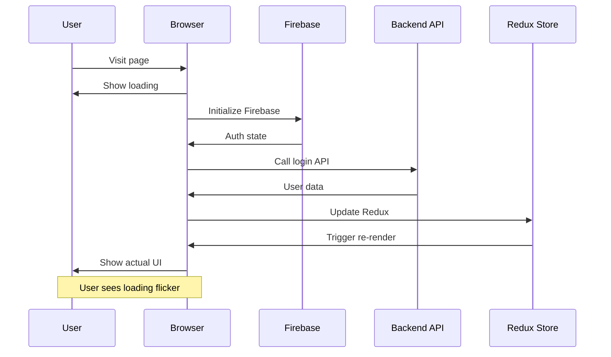
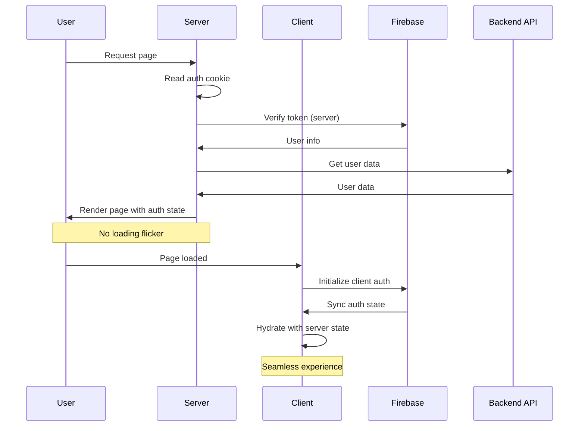

# Phân tích Enhanced Firebase Authentication cho NoteX

## 1. Tổng quan dự án hiện tại

### Kiến trúc Authentication hiện tại
Dựa trên source code đã phân tích:

**Files liên quan:**
- `config/firebaseConfig.ts` - Cấu hình Firebase cơ bản
- `services/auth.services.ts` - Service gọi API backend
- `WelcomeWidget.tsx` - Component qu·∫£n l√Ω welcome modal
- `.env.example` - Các biến môi trường Firebase

**Flow hiện tại:**
```
User Login ‚Üí Firebase Auth (Client) ‚Üí Get Token ‚Üí Call Backend API ‚Üí Redux State ‚Üí UI Update
```

### Đánh giá kiến trúc hiện tại

#### ✅ Ưu điểm:
1. **Tách biệt rõ ràng**: Firebase chỉ làm authentication, business logic ở backend riêng
2. **Flexible**: Có thể thay đổi auth provider mà không ảnh hưởng backend
3. **Đã stable**: Hệ thống đang hoạt động ổn định
4. **Multi-version API**: Có cả v1 và v2 endpoints
5. **Enterprise ready**: Có enterprise services và meeting features

#### ❌ Nhược điểm:
1. **Client-side only**: Auth state chỉ có sau khi JavaScript load
2. **Loading flicker**: User thấy loading state trước khi biết auth status
3. **SEO kém**: Search engines không thấy được auth state
4. **Performance chậm**: Phải đợi JS bundle load + Firebase init + API call
5. **Complex state management**: `WelcomeWidget.tsx` có nhiều điều kiện phức tạp
6. **No SSR benefits**: Không tận dụng được server-side rendering

## 2. Phân tích Firebase Tutorial Pattern

### Ki·∫øn tr√∫c t·ª´ tutorial:
```
User Login ‚Üí Firebase Auth ‚Üí Cookie Storage ‚Üí Server Verification ‚Üí SSR ‚Üí Client Hydration
```

### Các tính năng chính:
1. **Server-side Authentication**: Auth state available trên server
2. **Cookie-based session**: Persistent auth state
3. **Multiple providers**: Google, Email/Password, Anonymous
4. **Real-time listeners**: Auto token refresh
5. **Enhanced security**: Server-side token verification

## 3. So s√°nh chi ti·∫øt

| Aspect | NoteX hiện tại | Firebase Tutorial | Đánh giá |
|--------|----------------|-------------------|----------|
| **Initial Load** | Client-side auth check | Server-rendered with auth | Tutorial tốt hơn |
| **Performance** | Chậm (JS + API calls) | Nhanh (SSR) | Tutorial tốt hơn |
| **SEO** | Kém (no auth context) | Tốt (server-rendered) | Tutorial tốt hơn |
| **User Experience** | Loading flicker | Instant render | Tutorial tốt hơn |
| **Security** | Token gửi qua API | Server verification | Tutorial tốt hơn |
| **Complexity** | Cao (Redux + manual) | Thấp (auto listeners) | Tutorial tốt hơn |
| **Backend Integration** | Custom API stable | Firebase ecosystem | NoteX tốt hơn |
| **Business Logic** | Flexible backend | Tied to Firebase | NoteX tốt hơn |
| **Payment System** | Paddle integrated | Không có | NoteX tốt hơn |
| **Enterprise Features** | Đầy đủ | Không có | NoteX tốt hơn |

## 4. Khuyến nghị Implementation Strategy

### 🎯 Hybrid Approach - Kết hợp tốt nhất của cả hai

#### Phase 1: SSR Authentication Enhancement
**Mục tiêu**: Giữ nguyên backend API, thêm SSR cho auth state

**Changes cần thiết:**
1. **Cookie Management**: 
   - Lưu Firebase token vào cookie `__session`
   - Server đọc cookie để verify auth state
   
2. **Server Components**:
   - T·∫°o `getAuthenticatedUser()` function cho server
   - Layout components render v·ªõi auth context
   
3. **Client Hydration**:
   - Sync client state v·ªõi server state
   - Maintain existing Redux store

#### Phase 2: Enhanced Auth Providers
**Mục tiêu**: Thêm multiple auth options

**Changes cần thiết:**
1. Email/Password authentication
2. Anonymous login cho guest users
3. Apple Sign-in (nếu cần)

#### Phase 3: Improved State Management
**Mục tiêu**: Simplify auth state logic

**Changes cần thiết:**
1. Replace manual checks trong `WelcomeWidget.tsx`
2. Use Firebase listeners thay vì Redux polling
3. Auto token refresh

## 5. Implementation Flow

### Current Flow (Có vấn đề):

```mermaid
sequenceDiagram
    participant U as User
    participant B as Browser
    participant F as Firebase
    participant API as Backend API
    participant R as Redux Store
    
    U->>B: Visit page
    B->>U: Show loading
    B->>F: Initialize Firebase
    F->>B: Auth state
    B->>API: Call login API
    API->>B: User data
    B->>R: Update Redux
    R->>B: Trigger re-render
    B->>U: Show actual UI
    
    Note over U,B: User sees loading flicker
```

### Proposed Flow (Cải thiện):

```mermaid
sequenceDiagram
    participant U as User
    participant S as Server
    participant C as Client
    participant F as Firebase
    participant API as Backend API
    
    U->>S: Request page
    S->>S: Read auth cookie
    S->>F: Verify token (server)
    F->>S: User info
    S->>API: Get user data
    API->>S: User data
    S->>U: Render page with auth state
    
    Note over U,S: No loading flicker
    
    U->>C: Page loaded
    C->>F: Initialize client auth
    F->>C: Sync auth state
    C->>C: Hydrate with server state
    
    Note over C: Seamless experience
```

## 6. Architecture Comparison

### Current Architecture:
```mermaid
graph TD
    A[User] --> B[Client App]
    B --> C[Firebase Auth Client]
    B --> D[Redux Store]
    B --> E[Backend API]
    C --> F[Firebase Project]
    E --> G[Database]
    E --> H[Business Logic]
    
    style B fill:#ffcccc
    style D fill:#ffcccc
    Note: "Client-side heavy"
```

### Proposed Architecture:
```mermaid
graph TD
    A[User] --> B[Server Components]
    A --> C[Client Components]
    B --> D[Firebase Server App]
    C --> E[Firebase Client]
    B --> F[Cookie Storage]
    C --> G[Redux Store]
    B --> H[Backend API]
    C --> H
    D --> I[Firebase Project]
    E --> I
    H --> J[Database]
    H --> K[Business Logic]
    
    style B fill:#ccffcc
    style F fill:#ccffcc
    Note: "Server-side enhanced"
```

## 7. Migration Plan

### Step 1: Preparation
- [ ] Setup Firebase Server App
- [ ] Create cookie utilities
- [ ] Create server auth functions

### Step 2: Server-side Auth
- [ ] Implement `getAuthenticatedUser()` 
- [ ] Update layout components
- [ ] Add cookie-based session management

### Step 3: Client Enhancement
- [ ] Update auth listeners
- [ ] Sync server/client state
- [ ] Simplify `WelcomeWidget.tsx`

### Step 4: Testing & Optimization
- [ ] Test SSR performance
- [ ] Verify auth flows
- [ ] Monitor loading times

## 8. Risk Assessment

### 🔴 High Risk:
- **Backend API compatibility**: Cần đảm bảo không break existing API calls
- **Redux state conflicts**: Server state vs client state sync issues
- **Cookie security**: CSRF và session hijacking risks

### üü° Medium Risk:
- **Performance regression**: SSR có thể chậm hơn nếu implement sai
- **SEO impact**: Temporary SEO issues during migration
- **User experience**: Potential auth flow disruptions

### 🟢 Low Risk:
- **Firebase costs**: Minimal increase
- **Code complexity**: Manageable with proper planning
- **Rollback capability**: Can revert to current system

## 9. Success Metrics

### Performance:
- **Time to Interactive**: Gi·∫£m 30-50%
- **First Contentful Paint**: Cải thiện với SSR
- **Auth State Resolution**: Instant thay vì 500-1000ms

### User Experience:
- **Loading Flicker**: Eliminate hoàn toàn
- **Login Success Rate**: Maintain 99%+
- **User Complaints**: Giảm về loading issues

### Technical:
- **SEO Score**: Cải thiện auth-related pages
- **Code Maintainability**: Gi·∫£m complexity trong auth components
- **Security**: Enhanced v·ªõi server-side verification

## 10. K·∫øt lu·∫≠n

### Khuyến nghị: ✅ NÊN THỰC HIỆN

**L√Ω do:**
1. **ROI cao**: Effort vừa phải nhưng cải thiện UX đáng kể
2. **Backward compatible**: Không break existing features
3. **Future-proof**: Chuẩn bị cho scale lớn hơn
4. **Competitive advantage**: Better performance vs competitors

### Timeline ước tính:
- **Phase 1 (SSR Auth)**: 2-3 weeks
- **Phase 2 (Multi-providers)**: 1-2 weeks  
- **Phase 3 (State optimization)**: 1 week
- **Testing & Polish**: 1 week

**Total: 5-7 weeks**

### Next Steps:
1. T·∫°o detailed spec v·ªõi requirements
2. Setup development environment
3. Implement Phase 1 v·ªõi SSR Authentication
4. Gradual rollout v·ªõi feature flags